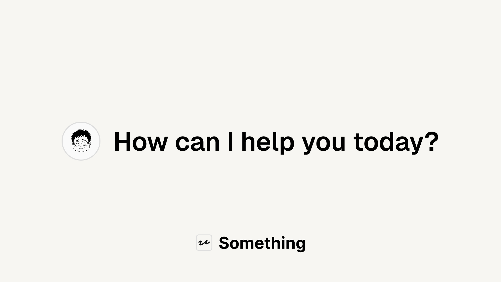
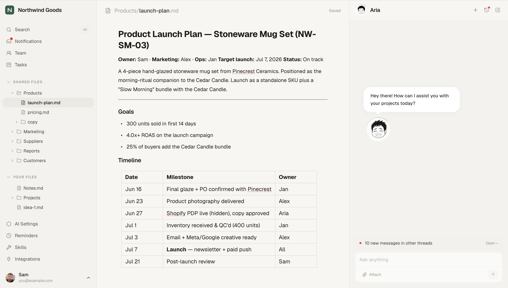
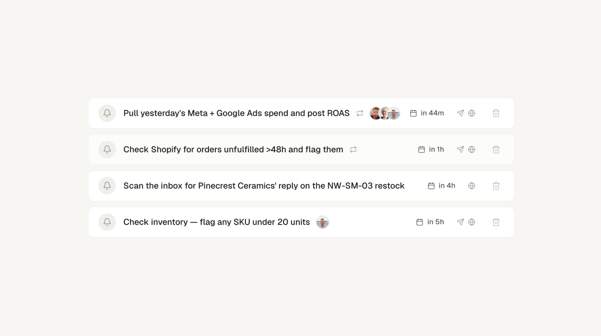
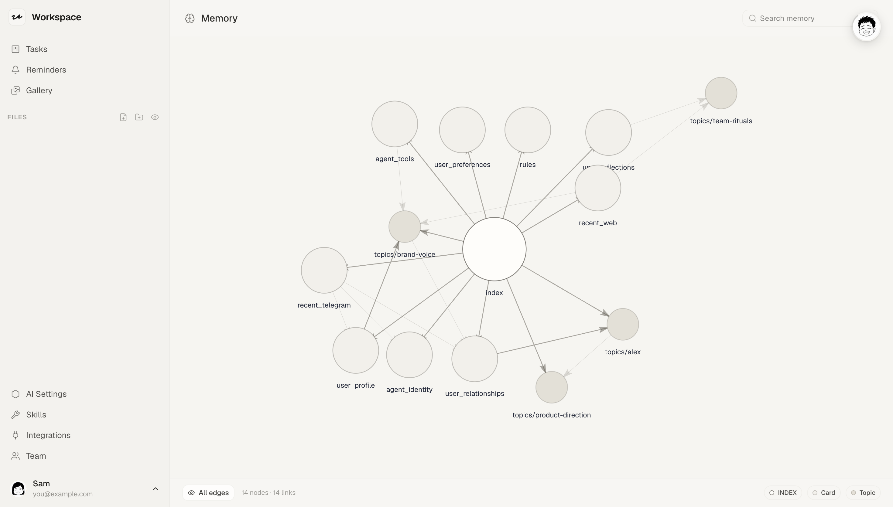
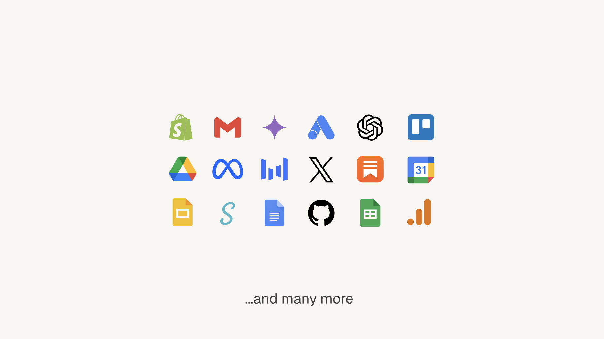

<h1 align="center">Something</h1>

<p align="center">
  <b>Your own AI coworker. Runs 24/7. Knows your business.</b>
</p>

<p align="center">
  <sub>
    <a href="#get-started">Get started</a>
    &nbsp;·&nbsp;
    <a href="#demo">Demo</a>
    &nbsp;·&nbsp;
    <a href="#integrations">Integrations</a>
    &nbsp;·&nbsp;
    <a href="#deploy-your-own">Deploy</a>
    &nbsp;·&nbsp;
    <a href="docs/ARCHITECTURE.md">Architecture</a>
  </sub>
</p>

<br/>

<p align="center">
  
</p>

<p align="center">
  A coworker that knows your context — your tools, your customers, your goals.<br/>
  You talk to them through Telegram or a private web workspace. They act on your behalf, not just answer.
</p>

<br/>
<br/>

## What they do
- **Have their own name and personality.** Set up once during the first-login wizard.
- **Live on Telegram and the web.** Pick one or both. Same memory, same context.
- **Remember between sessions.** Markdown notes, a knowledge graph, recent threads.
- **Act on your tools.** Pull Shopify orders, draft Gmail replies, schedule Instagram posts, query GA4. You approve before anything goes out.
- **Ping you proactively.** Restock alerts, weekly reports, deadlines. They schedule their own follow-ups.
- **Write their own playbooks.** *Skills* (markdown files) describe how to handle recurring tasks. Editable from the UI.
- **Track tasks with you.** A `Tasks.md` becomes a list-or-board view with owner, priority, and deadline — your coworker keeps it up to date as work moves.


<br/>

<a id="get-started"></a>

## Get started

**You'll need:** a Linux server (from ~€4.50/mo), a domain, a Google account, and a **paid Claude plan** (Pro or Max). Run the installer from macOS or Linux — on Windows, use WSL2.

Then, from your own computer, run:

```bash
curl -fsSL https://raw.githubusercontent.com/stanislawherjan1/Something/main/install.sh | bash
```

Prefer to read it before running? Download, skim, then execute — same result:

```bash
curl -fsSL https://raw.githubusercontent.com/stanislawherjan1/Something/main/install.sh -o install.sh
less install.sh    # review exactly what it does
bash install.sh
```

The installer guides you through setup interactively. It asks for your Google sign-in app, server address, domain, and admin email, then deploys. Plan for ~45–60 minutes end to end — most of it waiting on the server, DNS, and the first build.

First time renting a server or pointing a domain? **[Full step-by-step guide →](docs/QUICK_START.md)**

**Not comfortable in the terminal?** Open this repo in an AI coding tool — [Claude Code](https://www.anthropic.com/claude-code), Cursor, or Codex — and ask it to run the installer, read back any errors, and even customize the project for you. You still create the accounts (Google, server, domain); the agent drives the rest.

<br/>

## Demo

<p align="center">
  
</p>

<br/>

## Talk to them anywhere

Your coworker is one mind with two front doors — a **Telegram** DM and the **web workspace chat**. Same name, same memory, same context, whichever you reach for.

- **Telegram** — message them like any contact. Best for on-the-go asks and getting pinged wherever you are.
- **Web chat** — a full workspace alongside your files, skills, and dashboards. Each conversation is its own thread, so a dozen lines of work can run in parallel without blurring together.

It's all connected. What you told them in Telegram is there when you open the web chat later, and what you worked through on the web is there back in Telegram. Each thread stays its own conversation, but your coworker keeps cross-surface awareness — it sees what recently happened on the other channel and draws on it when relevant, instead of mistaking a separate conversation for a direct continuation of this one.

Proactive messages travel the same paths. When a scheduled job wraps or a reminder comes due, your coworker reaches you on Telegram, in the web app, or both — and a web ping arrives as a notification you can click straight into the thread it came from.

<br/>

## Skills

A *Skill* is a markdown file that tells your coworker how to handle one recurring task — like a job description for a single responsibility.

```markdown
---
name: weekly-ads-review
description: Every Monday, pull the last 7 days of Meta + Google Ads and post a one-pager.
---

Compare ROAS to the previous week. Flag any campaign that dropped >20%.
Surface 2–3 budget moves. Save to Reports/.
```

Create, edit, and delete skills from the dashboard. Integration-specific skills auto-install when the matching integration is activated. See [docs/SKILLS.md](docs/SKILLS.md).

<br/>

## Reminders

<p align="center">
  
</p>

<br/>

Tell your coworker when to ping you, and they will — once, daily, or weekly. Reminders survive container restarts, reach you on Telegram, in the web app, or both, and live in a tidy dashboard you can edit by hand.

> **You** — Remind me to chase Maison Lou about the linesheet tomorrow at 4pm.<br/>
> **Coworker** — Set. I'll ping you tomorrow at 16:00.

Your coworker also schedules their own — a Monday board review, a first-of-the-month revenue pull — whenever a recurring rhythm makes sense.

<br/>

## Memory

<p align="center">
  
</p>

<br/>

Your coworker doesn't start from zero every conversation. A small markdown wiki under `project/memory/` holds the basics — who you are, who's on your team, what your hard rules are, what the active integrations can do — plus rolling snapshots of your most recent web + Telegram exchanges. The whole block is loaded into the bot's system prompt on every turn so you never have to re-explain context.

Open **AI Settings → Memory** to see it as a graph: cards (facts), topic pages (long-form), and the two auto-maintained rolling snapshots, all linked together. Click any node to see the file, search to highlight, and let the bot maintain itself — `reflect-learnings` writes new facts after each session, `reflect-organizer` promotes overgrown card sections to topic pages, `taste-recall` reminds the bot of past mistakes before it repeats them.

Inspired by [Karpathy's LLM-wiki](https://gist.github.com/karpathy/442a6bf555914893e9891c11519de94f) pattern, and built in collaboration with [@jandziew](https://github.com/jandziew). Full design + operational guide in [docs/MEMORY.md](docs/MEMORY.md).

<br/>

## Integrations

<p align="center">
  
</p>

<br/>

| Integration | What it gives your coworker |
|---|---|
| Shopify | Orders, products, inventory; draft orders, fulfillments |
| Meta Ads | Instagram + Facebook ads, campaigns, audiences, Page/IG insights |
| Google Ads | Campaigns, ad groups, keywords, Keyword Planner, reports |
| Google Analytics 4 | Traffic, events, conversions — queried from chat |
| Google Workspace | Docs, Sheets, Calendar, Drive, Slides, Tasks — one OAuth, six services |
| Email (IMAP) | Multi-account inbox (Gmail / Zoho / custom); read by default, sending opt-in |
| Trello | Cards, comments, labels, move between columns |
| GitHub | Repos, issues, pull requests |
| Substack | Posts, authors, Notes; optional write access |
| X | Tweets, profiles, replies, mentions (via twitterapi.io) |
| Grok (xAI) | Live X + web search — real-time takes, fact-checks |
| OpenAI (GPT) · Gemini | Second opinions from GPT-5 / Gemini 2.5 |
| Image generation | Seedream 4.5 + Google Imagen 3 / Gemini — generate & edit |
| SignWell | Send documents for e-signature |
| Docs Comments | Inline comments anchored to text in Google Docs |

You activate each one from the Integrations dashboard — no redeploy, no `.env` editing. Credentials are encrypted at rest; removing an integration wipes the secret. Setup details in [docs/INTEGRATIONS.md](docs/INTEGRATIONS.md).

<br/>

## Self-hosted, end-to-end

Each client gets their own server. One per business, isolated by design — your data, your coworker, your tools, nobody else's. They live there 24/7 listening for Telegram messages; the web workspace runs at your own subdomain, gated by Google login and a team whitelist.

Every line of code is public. You give your coworker access to your inbox, your store, your ads — you should be able to see exactly what they do with that access. Architecture in [docs/ARCHITECTURE.md](docs/ARCHITECTURE.md), threat model in [docs/SECURITY.md](docs/SECURITY.md).

<br/>

## Deploy your own

Requires a Hetzner VPS (from ~€4.50/mo), a domain, and a paid Claude plan. Nothing runs locally — `deploy.sh` SSHs into the VPS and builds there.

**The easy way** — the interactive installer (see [Get started](#get-started)):

```bash
curl -fsSL https://raw.githubusercontent.com/stanislawherjan1/Something/main/install.sh | bash
```

**The manual way** — once a client dir exists, deploy is a one-liner:

```bash
cd clients/my-client && ./deploy.sh
```

Beginner walkthrough in [docs/QUICK_START.md](docs/QUICK_START.md). End-to-end manual onboarding in [docs/NEW_CLIENT.md](docs/NEW_CLIENT.md). Operations reference in [docs/DEPLOY.md](docs/DEPLOY.md).

<br/>

## Docs

**Start here**
- **[QUICK_START.md](docs/QUICK_START.md)** — first deployment, beginner-friendly: buy a server, point a domain, one command. Start here if it's your first time.
- [NEW_CLIENT.md](docs/NEW_CLIENT.md) — the manual, click-by-click version of the same flow; also how an operator onboards additional deployments with full control over each step.

**Reference**
- [INTEGRATIONS.md](docs/INTEGRATIONS.md) — the integration catalog, self-service activation, encrypted credentials
- [SKILLS.md](docs/SKILLS.md) — reusable Claude playbooks + dashboard editor
- [MEMORY.md](docs/MEMORY.md) — Karpathy-style LLM-wiki: cards, topics, rolling snapshots, reflect-bots
- [TEAM_MODE.md](docs/TEAM_MODE.md) — collaborative workspaces: roster & roles, Shared vs Personal files/memory, per-recipient reminders, task assignment, cross-surface relay
- [ARCHITECTURE.md](docs/ARCHITECTURE.md) — system design and data flows (with a glossary up top)
- [SECURITY.md](docs/SECURITY.md) — threat model, auth layers, vulnerability reporting
- [DEPLOY.md](docs/DEPLOY.md) — production deployment & day-2 operations reference
- [CONTRIBUTING.md](CONTRIBUTING.md) — conventions, PR vs direct push
