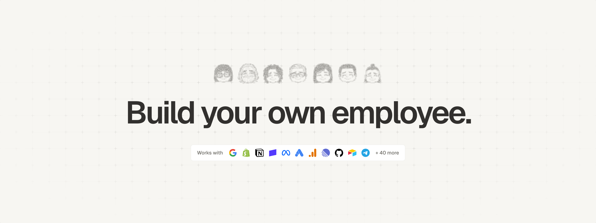
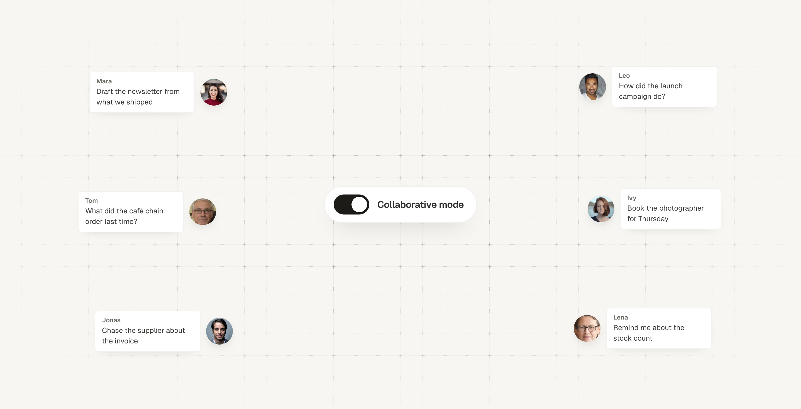
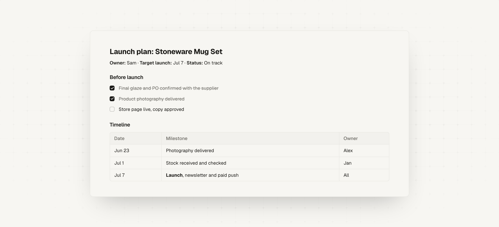
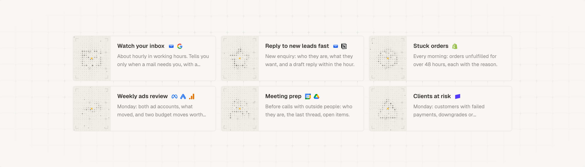
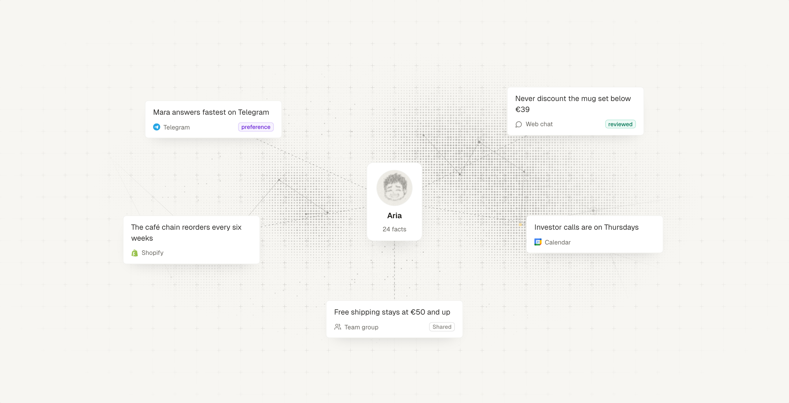
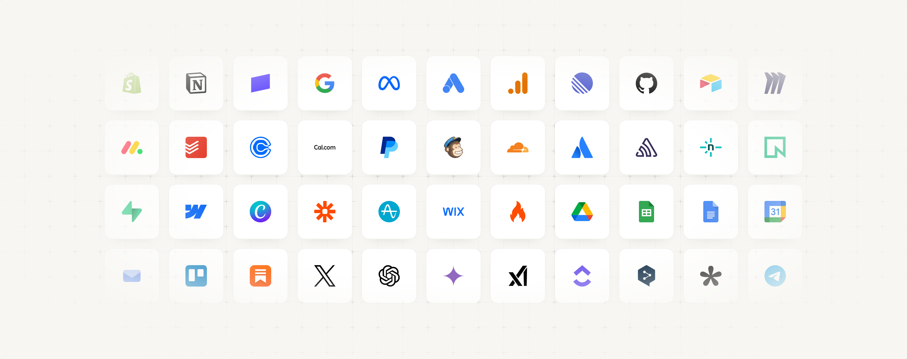
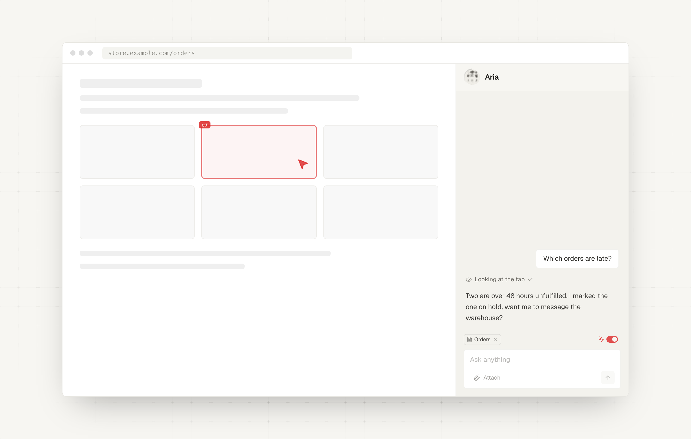

<h1 align="center">Something</h1>

<p align="center">
  <b>Your own AI coworker. Runs 24/7, knows your business, works with your team.</b>
</p>

<p align="center">
  <sub>
    <a href="https://something.md">Website</a>
    &nbsp;·&nbsp;
    <a href="#get-started">Get started</a>
    &nbsp;·&nbsp;
    <a href="#team">Team</a>
    &nbsp;·&nbsp;
    <a href="#integrations">Integrations</a>
    &nbsp;·&nbsp;
    <a href="#deploy-your-own">Deploy</a>
    &nbsp;·&nbsp;
    <a href="docs/ARCHITECTURE.md">Architecture</a>
  </sub>
</p>

<br/>

<p align="center">
  
</p>

<p align="center">
  Something lets you build a self-hosted AI coworker who knows your tools, your customers and your goals.<br/>
  You reach them in a private web workspace, in Chrome's side panel or on Telegram, and they do the work.
</p>

<br/>
<br/>

## What they do

Everything you'd reach for to automate your work (markdown for context, skills for playbooks, MCP for tools), but off the terminal: a calm UI, always on, shared with your team. 

Your coworkers:

- **Have a name and a personality.** Set once in the first-login wizard.
- **Live on the web, in Chrome and on Telegram.** Pick any; same memory everywhere.
- **Remember between sessions.** Markdown notes, a knowledge graph, recent threads.
- **Act on your tools.** Pull Shopify orders, draft Gmail replies, schedule Instagram posts, query GA4, and ask before anything goes out.
- **Reach out first.** Restock alerts, weekly reports, deadlines; they schedule their own follow-ups.
- **Write their own playbooks.** A *skill* is a markdown file describing how to handle a recurring task, editable right from the UI.
- **Keep the task list moving.** Your `Tasks.md` becomes a list or board view with owner, priority, and deadline, kept current as work progresses.
- **Work with your whole team.** Turn on collaborative mode: everyone signs in with their own account and a private space beside the shared one, and your coworker routes routines, tasks, and messages to the right person.

<br/>

## Why it's different

- **Built for the whole team, not just engineers.** The power of a terminal AI agent, in a calm UI that non-technical people actually live in.
- **It reasons, it doesn't just route.** Not if-this-then-that automation. It reads the situation, pulls from your tools, decides what to do, then asks before anything goes out.
- **Your server, full source.** Self-hosted on a box you control, one per business: your files, memory and credentials live there. Conversations are answered by Claude through your own plan, the same as when you use Claude directly. You hand it your inbox, store, and ads, so everything it does with that access is public and auditable.

<br/>

<a id="get-started"></a>

## Get started

**You'll need:** a Linux server (from ~€4.50/mo), a domain, a Google account, and a **paid Claude plan** (Pro or Max). Run the installer from macOS or Linux (on Windows, use WSL2).

Then, from your own computer, run:

```bash
curl -fsSL https://raw.githubusercontent.com/stanislawherjan1/Something/main/install.sh | bash
```

Prefer to read it before running? Download, skim, then execute for the same result:

```bash
curl -fsSL https://raw.githubusercontent.com/stanislawherjan1/Something/main/install.sh -o install.sh
less install.sh    # review exactly what it does
bash install.sh
```

The installer is interactive: it asks for your Google sign-in app, server address, domain, and admin email, then deploys. Plan for 45-60 minutes end to end, most of it waiting on the server, DNS, and the first build.

First time renting a server or pointing a domain? **[Full step-by-step guide →](docs/QUICK_START.md)**

**Not comfortable in the terminal?** Open this repo in an AI coding tool ([Claude Code](https://www.anthropic.com/claude-code), Cursor, or Codex) and ask it to run the installer, read back errors, and customize the project for you. You create the accounts (Google, server, domain); the agent does the rest.

<br/>

## Talk to them anywhere

Your coworker is one mind you reach from a few places: the **web workspace chat**, a **Telegram** DM, the **team Telegram groups** it's part of, and **Chrome's side panel**, next to whatever page you're on. Same name, same memory, same context, whichever you reach for.

- **Web chat**: a full workspace alongside your files, skills, and dashboards. Each conversation is its own thread, so a dozen lines of work can run in parallel without blurring together.
- **Chrome side panel**: the same chat beside any tab. It sees the page you're on, and with your go-ahead clicks and types in it for you ([below](#browser)).
- **Telegram**: message them like any contact. Best for on-the-go asks and getting pinged wherever you are.
- **Telegram groups**: add it to a team group and it follows the conversation, chiming in when it's genuinely useful and staying quiet otherwise. It only takes part in groups a teammate brings it into, never barging in on its own.

It's all connected. What you said on Telegram is there when you open the web chat, and the other way round. Each thread stays its own conversation, but your coworker keeps cross-surface awareness: it knows what recently happened on the other channel and draws on it when it helps.

Proactive messages travel the same paths. When a job finishes or a reminder comes due, your coworker pings you on Telegram, in the web app, or both; a web ping is a notification you click straight into its thread.

<br/>

<a id="team"></a>

## One coworker, your whole team

<p align="center">
  
</p>

<br/>

Flip on **collaborative mode** and your coworker stops being only *yours*; it becomes the team's, while still knowing each of you as an individual. Everyone signs in with their own Google account, and an admin keeps the roster: invite people, set roles (admin or member), link their Telegram.

Now there's a shared workspace and a private one for each person, side by side:

- **Shared**: the files, the task board, and the team-wide memory everyone works from.
- **Yours**: your own files and your own memory cards, scoped to you. A teammate can't read them, and your coworker won't go digging through them on someone else's behalf.

The default is collaboration, not secrecy: ask *"did Mara finish the report?"* and it answers from the shared work. Private cards are the exception, and they stay private.

Because it knows the whole team, it routes work to the right person, and carries messages between you:

> **You:** Remind Mara to send the review tomorrow morning.<br/>
> **Coworker:** Done. I'll ping Mara at 9:00 tomorrow, in her workspace, and on Telegram since that's how she likes to be reached.

Routines and tasks can target one teammate or *everyone*, and a task's owner is a real face on the board. You can also talk *through* your coworker: it delivers your message into a colleague's workspace or Telegram, in their language, phrased like a person, not a forwarded memo.

Solo setups are untouched: team mode off means no roles, no split, no routing, just the clean single-user workspace. Full design in **[docs/TEAM_MODE.md](docs/TEAM_MODE.md)**.

<br/>

## A real editor, your coworker writes to it too

<p align="center">
  
</p>

<br/>

Everything your coworker knows is plain markdown: notes, skills, memory, reports. The web app opens it in a clean, Notion-style editor (headings, checklists, tables, slash commands), but saves byte-for-byte markdown on disk, so git diffs and the bot's own edits stay clean.

It's a shared surface. You and your coworker edit the **same** files: write a launch checklist and the bot ticks items off as it does the work; ask it to draft a report, then polish it yourself. When it changes a file you have open, the edit flashes in live, and file paths (in chat or in a note) are clickable: mention `Products/pricing.md` and it opens.

<br/>

## Routines

<p align="center">
  
</p>

<br/>

Tell your coworker what to keep an eye on, and it takes it from there. These are the standing things it handles for you without being asked: scan the inbox each hour, chase threads that have gone quiet, watch approaching deadlines, prep meeting materials the day before. Every morning it plans the day from these routines, together with your calendar, tasks, and open threads.

> **You:** From now on, each morning check Shopify for orders stuck unfulfilled over 48h and flag them.<br/>
> **Coworker:** Added to my routines. I'll check every morning and flag anything stuck.

Under the hood, routines run on **reminders**: a background scheduler that survives container restarts and fires on time (once, daily, weekly, or continuous), reaching you on Telegram, in the web app, or both. You rarely touch it directly: the coworker sets and prunes its own reminders as the routines demand.

<br/>

## Memory

<p align="center">
  
</p>

<br/>

Your coworker doesn't start from zero each conversation. A small markdown wiki under `project/memory/` holds the basics (who you are, your team, your hard rules, what each integration can do) plus rolling snapshots of recent web and Telegram exchanges. It loads into the system prompt every turn, so you never re-explain context. In a [team workspace](#team) it splits like the files do: shared cards everyone works from, private cards that are only yours.

Open **AI Settings → Memory** to see it as a graph: cards (facts), topic pages (long-form), and the rolling snapshots, all linked. Click a node to open the file, or search to highlight. The bot maintains it itself: writing new facts after each session, promoting overgrown sections to their own pages, and reminding itself of past mistakes before it repeats them.

Inspired by [Karpathy's LLM-wiki](https://gist.github.com/karpathy/442a6bf555914893e9891c11519de94f) pattern, and built in collaboration with [@jandziew](https://github.com/jandziew). Full design + operational guide in [docs/MEMORY.md](docs/MEMORY.md).

<br/>

## Integrations

<p align="center">
  
</p>

<br/>

**One-click — sign in, no keys to paste.** Two dozen provider-hosted MCP servers connect with a single popup: sign in, approve, done. No API keys, and nothing for whoever deploys the product to register — the workspace-api OAuth broker registers itself on the fly (Dynamic Client Registration) and completes the flow on the client's own domain.

> Notion · Stripe · Linear · Airtable · Miro · monday.com · Todoist · Cal.com · Calendly · PayPal · Klaviyo · Mailchimp · Cloudflare · Atlassian (Jira/Confluence) · Sentry · Netlify · Neon · Supabase · Webflow · Canva · Zapier · Amplitude · Wix · Firecrawl · Parallel Search · Crypto.com

**Bring your own credentials.** The rest paste a key, token, or file once — encrypted at rest:

> Shopify · Meta Ads · Google Ads · Google Analytics 4 · Google Workspace · Email (IMAP) · Trello · GitHub · Substack · X · Grok (xAI) · OpenAI (GPT) · Gemini · Gemini Image · Seedream · SignWell · Docs Comments

You activate each one from the Integrations dashboard, no redeploy, no `.env` editing. Credentials are encrypted at rest; removing an integration wipes the secret. Setup details in [docs/INTEGRATIONS.md](docs/INTEGRATIONS.md).

<br/>

<a id="browser"></a>

## Right next to your browser

<p align="center">
  
</p>

<br/>

Install the Chrome extension from the workspace's **Browser agent** page and your coworker sits in the side panel, beside whatever you're looking at. It's the same chat, with the same memory and conversations, and it knows which page you're on.

- **It looks by itself.** Ask *"which of these orders are late?"* and it reads the page or takes a screenshot on its own. No copy-pasting, no "can you send me a screenshot".
- **It works in the page when you let it.** Flip the **Act** switch and it clicks, types, picks from dropdowns and scrolls for you: filling in a form, searching a site, working through a multi-step flow. You watch a cursor move as it goes, and it stops the moment you switch Act off.
- **It uses the API when that's better.** On a page of a service it's connected to, such as a calendar event, a Miro board or an email, it hands the job to the integration instead of clicking: *"move this meeting to 3pm"* becomes one Calendar call, not ten clicks.

It is fenced in code, not in the prompt: it stays on the site you're on, never touches password, one-time-code or card fields, refuses password managers, and while it can act on a page it has no way to send anything out. What a web page says is treated as content, never as an instruction. Full details in **[docs/BROWSER_EXTENSION.md](docs/BROWSER_EXTENSION.md)**.

<br/>

## Self-hosted, end-to-end

Each business gets its own server, isolated by design: your coworker, your files, your tools, nobody else's. Conversations are answered by Claude through your own plan, and nothing passes through our servers. They live there 24/7 listening for Telegram messages; the web workspace runs at your own subdomain, gated by Google login and a team whitelist.

Every line of code is public. You give your coworker access to your inbox, your store, your ads, so you should be able to see exactly what they do with that access. Architecture in [docs/ARCHITECTURE.md](docs/ARCHITECTURE.md), threat model in [docs/SECURITY.md](docs/SECURITY.md).

<br/>

## Deploy your own

Requires a Linux server (a Hetzner VPS from ~€4.50/mo works well), a domain, and a paid Claude plan. Nothing runs locally; `deploy.sh` SSHs into the server and builds there.

The easiest way is the installer in [Get started](#get-started). Once a client dir exists, redeploying is a one-liner:

```bash
cd clients/my-client && ./deploy.sh
```

Beginner walkthrough in [docs/QUICK_START.md](docs/QUICK_START.md). End-to-end manual onboarding in [docs/NEW_CLIENT.md](docs/NEW_CLIENT.md). Operations reference in [docs/DEPLOY.md](docs/DEPLOY.md).

<br/>

## Docs

**Start here**
- **[QUICK_START.md](docs/QUICK_START.md)**, first deployment, beginner-friendly: buy a server, point a domain, one command. Start here if it's your first time.
- [NEW_CLIENT.md](docs/NEW_CLIENT.md), the manual, click-by-click version of the same flow; also how an operator onboards additional deployments with full control over each step.

**Reference**
- [INTEGRATIONS.md](docs/INTEGRATIONS.md), the integration catalog, self-service activation, encrypted credentials
- [SKILLS.md](docs/SKILLS.md), reusable Claude playbooks + dashboard editor
- [MEMORY.md](docs/MEMORY.md), Karpathy-style LLM-wiki: cards, topics, rolling snapshots, reflect-bots
- [ROUTINES.md](docs/ROUTINES.md), routines, the morning planner, and reminders and how they fire
- [BROWSER_EXTENSION.md](docs/BROWSER_EXTENSION.md), the Chrome side panel: Look, Act, the hand-off to integrations, every limit and where it is enforced
- [TEAM_MODE.md](docs/TEAM_MODE.md), collaborative workspaces: roster & roles, Shared vs Personal files/memory, per-recipient reminders, task assignment, cross-surface relay
- [ARCHITECTURE.md](docs/ARCHITECTURE.md), system design and data flows (with a glossary up top)
- [SECURITY.md](docs/SECURITY.md), threat model, auth layers, vulnerability reporting
- [DEPLOY.md](docs/DEPLOY.md), production deployment & day-2 operations reference
- [CONTRIBUTING.md](CONTRIBUTING.md), conventions, PR vs direct push

<br/>

## License

Open source under [AGPL-3.0](LICENSE). Made by stan corp.
